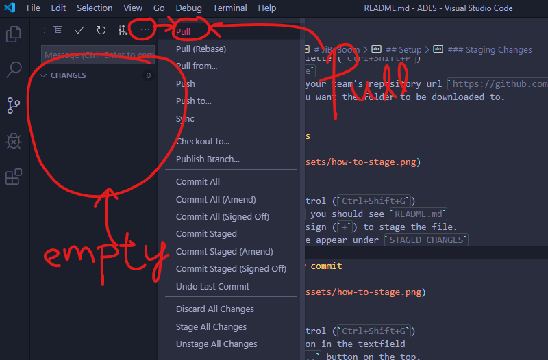

# JiBaBoom

## Names:

1. `[NAME HERE]`
2. `[NAME HERE]`

## Setup

1. Setup a Github account (Using any account)
2. Accept and access the assignment here: 
    1. ADES - https://classroom.github.com/g/Vcrmt0EG
    2. FSP - https://classroom.github.com/g/l3LALcr5
3. Clone the repository to your computer. [How?](#cloning-repository)
4. Stage some changes. [How?](#staging-changes)
5. Create a new commit. [How?](#creating-a-new-commit)
6. Pull from remote. [How?](#pull-from-remote)
7. Resolve any conflict. [How?](#resolving-conflict)
8. Push to remote. [How?](#push-to-remote)

### Cloning Repository

You may refer to this [stackoverflow link](https://stackoverflow.com/questions/38307647/clone-github-repository-in-vscode/38326710)

1. Go to VSCode
2. Open Command Palette (`Ctrl+Shift+P`)
3. Type `Git: Clone`
4. Copy and paste your team's repository url (e.g. `https://github.com/ADES-FSP/jibaboom-TEAMNAME`)
5. Choose where you want the folder to be downloaded to.
6. Clone. Done.

### Staging Changes

1. Go to VSCode
2. Edit the README.md file and add your name [above](#names)
3. Open Source Control (`Ctrl+Shift+G`)
4. Under `CHANGES` you should see `README.md`
5. Click the plus sign (`+`) to stage the file.
6. You see the file appear under `STAGED CHANGES`

### Creating a new commit

1. Go to VSCode
2. Open Source Control (`Ctrl+Shift+G`)
3. Add a description in the textfield
4. Click on the `...` button on the top.
5. Scroll and find `Commit Staged`
6. Click on `Commit Staged` to create a new commit.

### Pull from remote

1. Go to VSCode
2. Open Source Control (`Ctrl+Shift+G`)
3. Ensure you have no uncommited changes
4. Click on the `...` button on the top.
5. Click on `pull` to pull from remote.

### Resolving conflict

1. After you click pull, if there is merge conflict you'll see the following highlighting.
2. Modify the file, save it and create a new commit.

### Push to remote

1. Go to VSCode
2. Open Source Control (`Ctrl+Shift+G`)
3. Ensure you are up to date with remote
4. Click on the `...` button on the top.
5. Click on `push` to push to remote.
