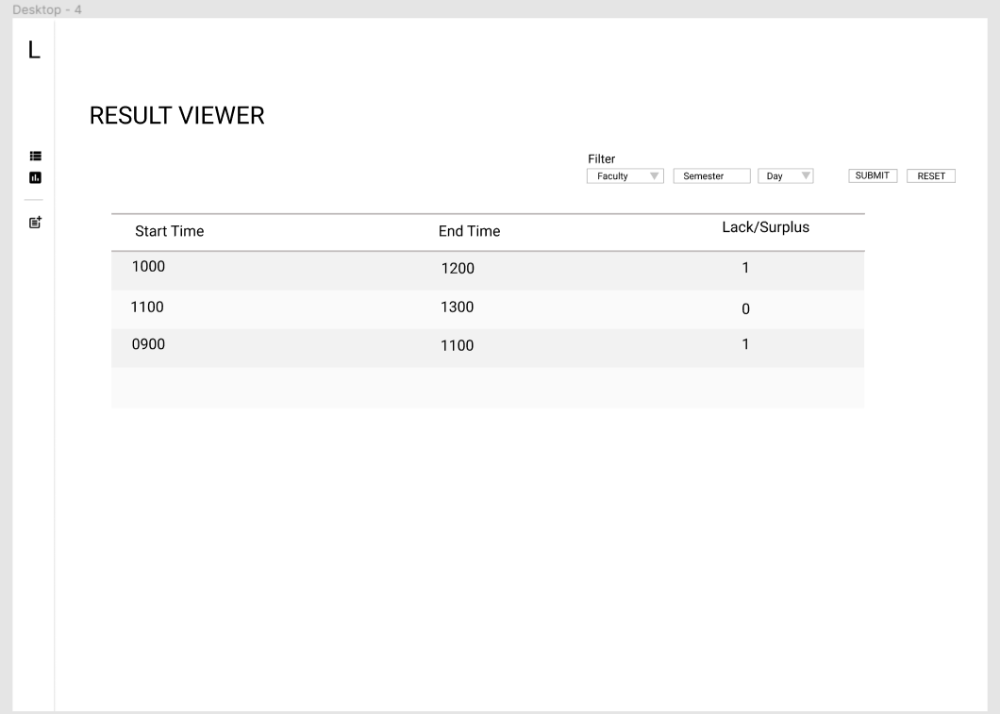

# Wireframe & Justification

This document should help you explain how your user interfaces are designed. You should have a wireframe to give a good overview and some screenshot with simple writeups to justify your designs.

## Wireframe

Advance result viewer Wireframe

## Justifications

### Justification 1

The result viewer is in table form. The Example Design is same as the dataviewer Wireframe

#### Good Points

#### Bad Points

### Justification 2

> Find more existing work for reference.

### Justification 3

> Find more existing work for reference.
