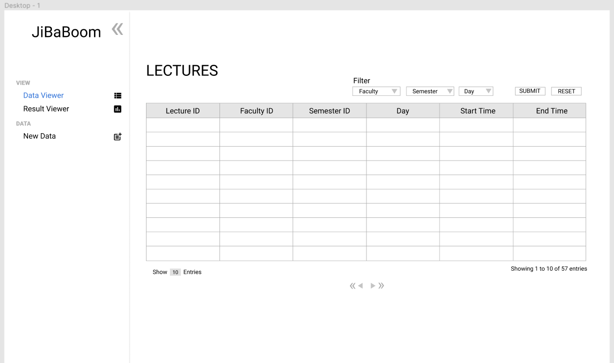
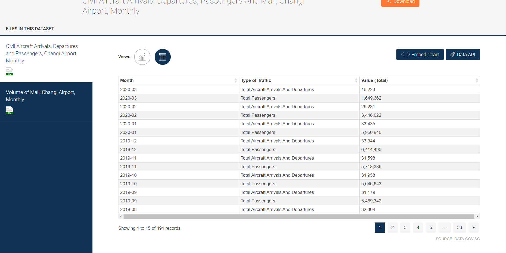
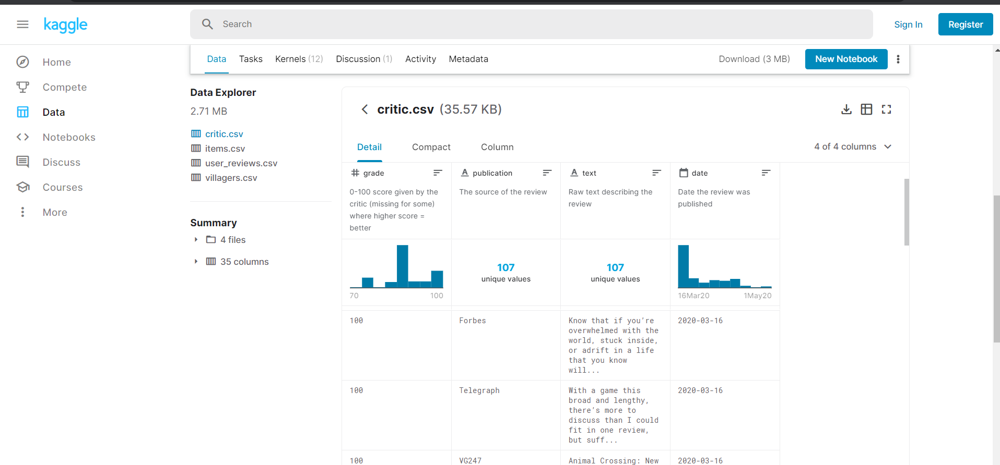
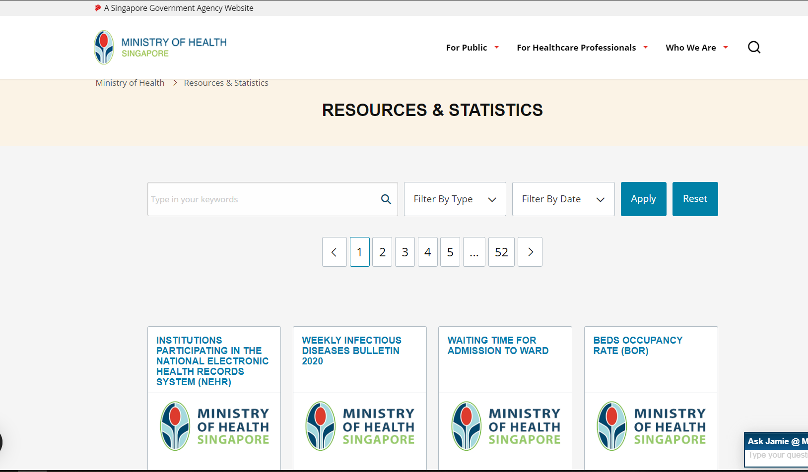

## Wireframe

### Justification 1

Example page from data.gov.sg(https://data.gov.sg/dataset/civil-aircraft-arrivals-departures-passengers-and-mail-changi-airport-monthly?view_id=f1000da9-4036-4278-b241-eeec524ca229&resource_id=1a08ce4d-aafc-4fee-afb7-e8f4c3a41d80) 
#### Good Points

1.Data.gov.sg data page has a very neat table 
2.they use grey and white to separate each row, allowing the user to have a better view of the data.  
3.there are only two color-dark blue and grey. Simple but pleasant to view. 
#### Bad Points
1.the table is small and very concentred 
2.would be better if there is more space in each cell 
### Justification 2

Kaggle(https://www.kaggle.com/jessemostipak/animal-crossing) 
#### Good Points

1.Kaggle has the whole table fixed in with no pagination.  
2.It saves time for the user, as they do not need to click on pages which may take time to load.  
3.they used a theme color of blue. 
#### Bad Points
1.the sidebar is higher than the main table. 
2.without pagination it would be hard for the user to view the data at the back 
### Justification 3

moh(https://www.moh.gov.sg/resources-statistics) 
#### Good Points

 1.they use a dropdown so that they don’t have to do validation on the user’s input, saves time for coding.  
 2.The reset button is good, the user doesn’t have to press backspace anymore. 
 #### Bad Points
 1.One thing I don’t like about the page is the pagination colour 
 2.current page colour is not very obvious, it could be better to have the whole bottom in another color as what data.gov.sg did 
