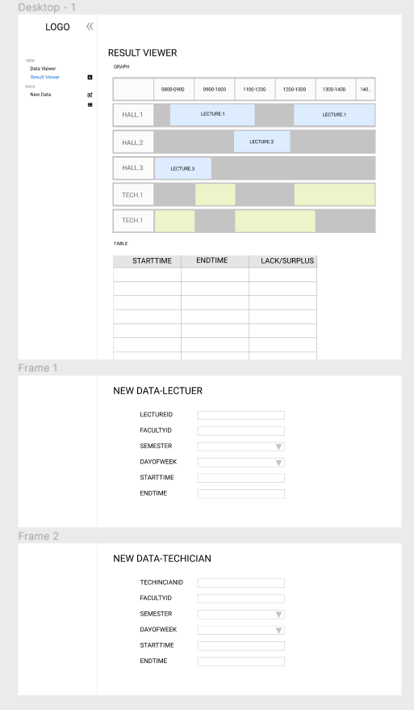
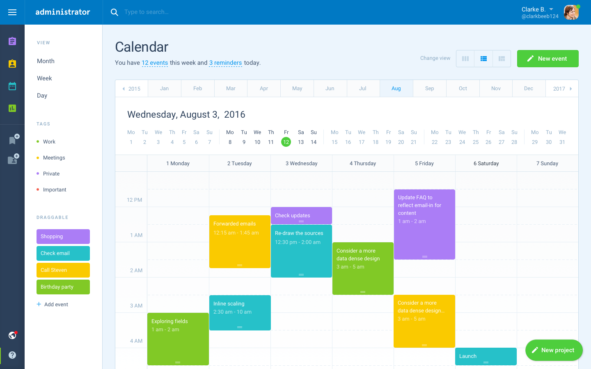

# Wireframe & Justification

## Wireframe

## Justifications

### Justification 1

#### Good Points

1. Nice looking UI.
2. Show data with start/end time appropriately.

#### Bad Points

1. Controls may not be relevent, need to redesign the controls.
2. May be hard to implement.

### Justification 2

#### Good Points
1.It is very easy for the user to look at the timing 
2.The design is simple but appealing to eyes 
#### Bad Points
1.The table is vertical. Does not really suit our project 

### Justification 3

#### Good Points
1.There is a line to indicate half an hour 
2.Very nice theme colour 
#### Bad Points
1.table is vertical 
2.Too many details for our project 
