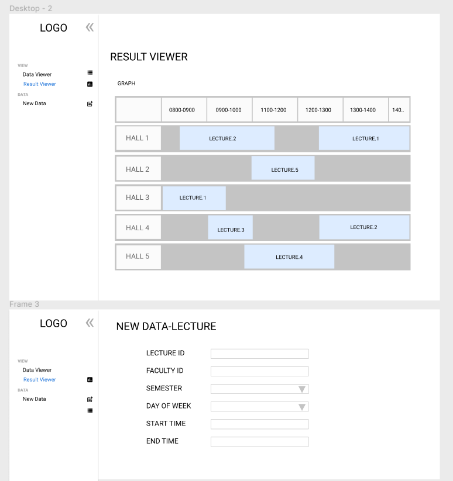
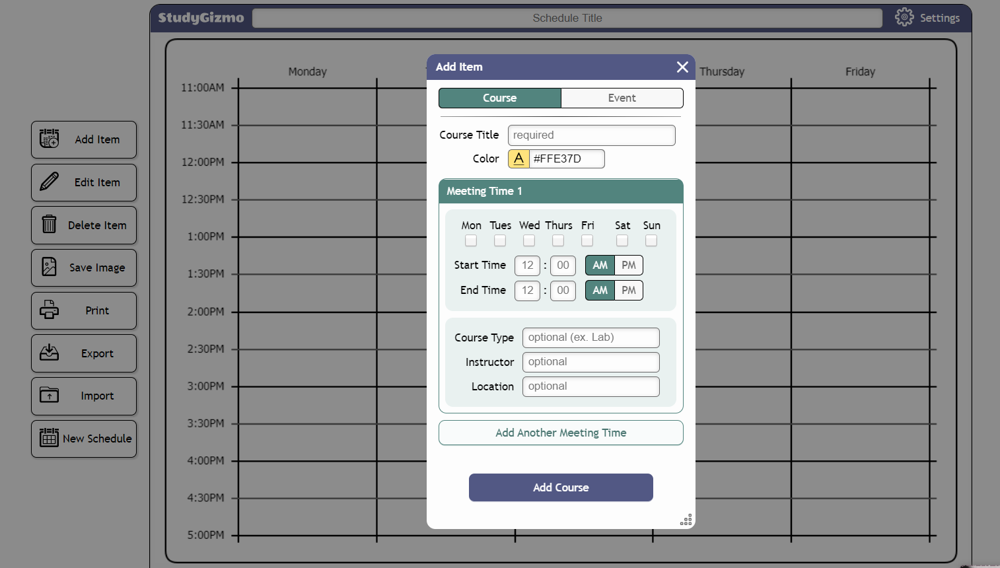
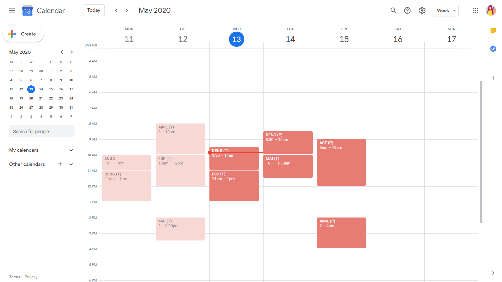
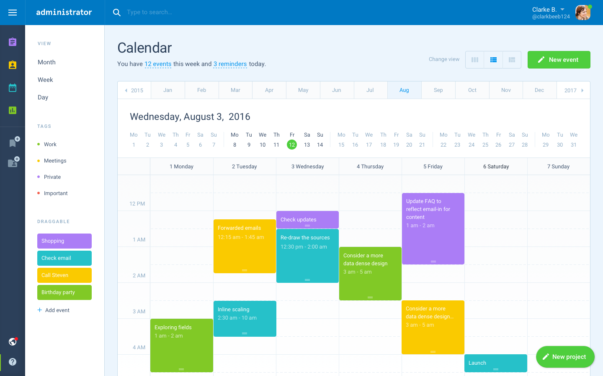

# Wireframe & Justification

## Wireframe

## Justifications

### Justification 1

Example from gizmo(https://www.freecollegeschedulemaker.com/)

#### Good Points

1. Very detailed and clear user input page.
2. The day of week choices are set as checkboxes, letting the user choose more than one time slot.
3. Good validation check for the time, e.g. when the user keys in a value larger than 12, it will be auto corrected to 12.

#### Bad Points

1. It could be time consuming to do the validation and the auto correct.
2. The form is too small, input is all clustered together.

### Justification 2

Example from Google Calendar(https://calendar.google.com/calendar/r?pli=1)
#### Good Points
1. It gives the user a clear overview of all the timings across the week.
2. The design is simple but appealing to the eyes.

#### Bad Points
1. The table is vertical. Does not really suit our project.

### Justification 3

Example from [Administrator Dashboard Design System](https://www.sketch.com/s/4044ecb5-2fef-436d-b1cd-6784f1528b50/a/Jpxxor) by [XDGuru / FigmaCrush](https://gumroad.com/l/jGvhc)
#### Good Points
1. There is a line to indicate half an hour.
2. There are different colors to signify the different tasks, we can use this to signify different faculties.
#### Bad Points
1. Table is vertical,
2. Too many details for our project, e.g. the calendar.
